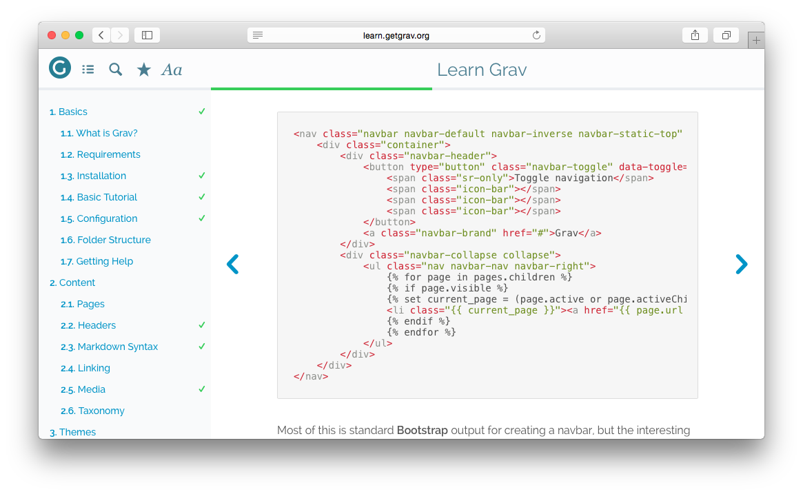

# Grav Highlight Plugin



`highlight` is a [Grav](http://github.com/getgrav/grav) plugin that adds simple and powerful code highlighting functionality utilizing the jQuery plugin [Highlight.js](https://highlightjs.org/).

# Installation

Installing the Highlight plugin can be done in one of two ways. Our GPM (Grav Package Manager) installation method enables you to quickly and easily install the plugin with a simple terminal command, while the manual method enables you to do so via a zip file. 

## GPM Installation (Preferred)

The simplest way to install this plugin is via the [Grav Package Manager (GPM)](http://learn.getgrav.org/advanced/grav-gpm) through your system's Terminal (also called the command line).  From the root of your Grav install type:

    bin/gpm install highlight

This will install the Highlight plugin into your `/user/plugins` directory within Grav. Its files can be found under `/your/site/grav/user/plugins/highlight`.

## Manual Installation

To install this plugin, just download the zip version of this repository and unzip it under `/your/site/grav/user/plugins`. Then, rename the folder to `highlight`. You can find these files either on [GitHub](https://github.com/getgrav/grav-plugin-highlight) or via [GetGrav.org](http://getgrav.org/downloads/plugins#extras).

You should now have all the plugin files under

    /your/site/grav/user/plugins/highlight

>> NOTE: This plugin is a modular component for Grav which requires [Grav](http://github.com/getgrav/grav), the [Error](https://github.com/getgrav/grav-plugin-error) and [Problems](https://github.com/getgrav/grav-plugin-problems) plugins, and a theme to be installed in order to operate.

# Usage

To best understand how Highlight works, you should read through the original project [documentation](https://highlightjs.org/usage/).

You can override any default settings from the page headers:

eg:

    ---
    title: Sample Code With Custom Theme
    highlight:
        theme: monokai
    ---

    ```
    @font-face {
      font-family: Chunkfive; src: url('Chunkfive.otf');
    }

    body, .usertext {
      color: #F0F0F0; background: #600;
      font-family: Chunkfive, sans;
    }

    @import url(print.css);
    @media print {
      a[href^=http]::after {
        content: attr(href)
      }
    }
    ```


You can also disable highlighting for a particular page if causes issues:

    ---
    title: Sample Code with Highlight disabled
    highlight:
        enabled: false
    ---

    ```
    @font-face {
      font-family: Chunkfive; src: url('Chunkfive.otf');
    }

    body, .usertext {
      color: #F0F0F0; background: #600;
      font-family: Chunkfive, sans;
    }

    @import url(print.css);
    @media print {
      a[href^=http]::after {
        content: attr(href)
      }
    }
    ```

Further, you can also enable line numbers on a specific page, or globally (in highlight.yaml):

    ---
    title: Sample Code with Highlight and line numbers enabled
    highlight:
        enabled: true
        lines: true
    ---

Valid theme options include: 

|                        |                          |                           |
| :--------------------- | :--------------------    | -----------------------   |
| arta                   | ascetic                  | atelier-dune.dark         |
| atelier-dune.light     | atelier-forest.dark      | atelier-forest.light      |
| atelier-heath.dark     | atelier-heath.light      | atelier-lakeside.dark     |
| atelier-lakeside.light | atelier-seaside.dark     | atelier-seaside.light     |
| brown_paper            | codepen-embed            | color-brewer              |
| dark                   | default                  | docco                     |
| far                    | foundation               | github                    |
| googlecode             | hybrid                   | idea                      |
| ir_black               | kimbie.dark              | kimbie.light              |
| learn                  | magula                   | mono-blue                 |
| monokai_sublime        | monokai                  | obsidian                  |
| paraiso.dark           | paraiso.light            | pojoaque                  |
| railscasts             | rainbow                  | school_book               |
| solarized_dark         | solarized_light          | sunburst                  |
| tomorrow-night-blue    | tomorrow-night-bright    | tomorrow-night-eighties   |
| tomorrow-night         | tomorrow                 | vs                        |
| xcode                  | zenburn                  |                           |
| agate                  | androidstudio            | atelier-cave.dark         |
| atelier-cave.light     | atelier-estuary.dark     | atelier-estuary.light     |
| atelier-plateau.dark   | atelier-plateau.light    | atelier-savanna.dark      |
| atelier-savanna.light  | atelier-sulphurpool.dark | atelier-sulphurpool.light |
| darkula                | github-gist              | pojoaque                  |
| school_bank            |                          |                           |

Check out a [live demo](https://highlightjs.org/static/demo/) of these themes.

> Note: If you want to see this plugin in action, have a look at [Grav Learn Site](http://learn.getgrav.org)

# Updating

As development for the Highlight plugin continues, new versions may become available that add additional features and functionality, improve compatibility with newer Grav releases, and generally provide a better user experience. Updating Highlight is easy, and can be done through Grav's GPM system, as well as manually.

## GPM Update (Preferred)

The simplest way to update this plugin is via the [Grav Package Manager (GPM)](http://learn.getgrav.org/advanced/grav-gpm). You can do this with this by navigating to the root directory of your Grav install using your system's Terminal (also called command line) and typing the following:

    bin/gpm update highlight

This command will check your Grav install to see if your Highlight plugin is due for an update. If a newer release is found, you will be asked whether or not you wish to update. To continue, type `y` and hit enter. The plugin will automatically update and clear Grav's cache.

## Manual Update

Manually updating Highlight is pretty simple. Here is what you will need to do to get this done:

* Delete the `your/site/user/plugins/highlight` directory.
* Downalod the new version of the Highlight plugin from either [GitHub](https://github.com/getgrav/grav-plugin-highlight) or [GetGrav.org](http://getgrav.org/downloads/plugins#extras).
* Unzip the zip file in `your/site/user/plugins` and rename the resulting folder to `highlight`.
* Clear the Grav cache. The simplest way to do this is by going to the root Grav directory in terminal and typing `bin/grav clear-cache`.

> Note: Any changes you have made to any of the files listed under this directory will also be removed and replaced by the new set. Any files located elsewhere (for example a YAML settings file placed in `user/config/plugins`) will remain intact.
