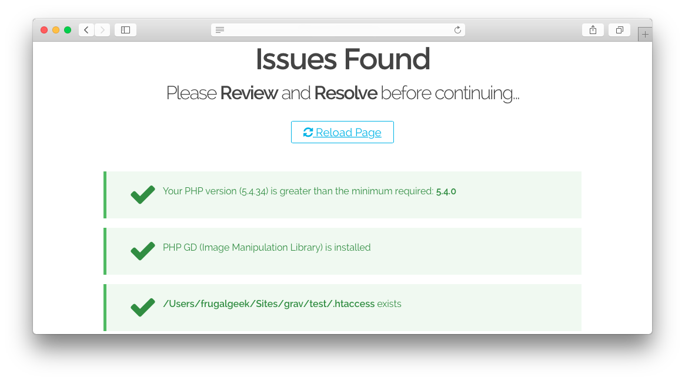

# Grav Problems Plugin

`Problems` is a [Grav](http://github.com/getgrav/grav) Plugin and allows to detect issues.

This plugin is included in any package distributed that contains Grav. If you decide to clone Grav from GitHub, you will most likely want to install this.

# Installation

Installing the Problems plugin can be done in one of two ways. Our GPM (Grav Package Manager) installation method enables you to quickly and easily install the plugin with a simple terminal command, while the manual method enables you to do so via a zip file.

## GPM Installation (Preferred)

The simplest way to install this plugin is via the [Grav Package Manager (GPM)](http://learn.getgrav.org/advanced/grav-gpm) through your system's Terminal (also called the command line).  From the root of your Grav install type:

    bin/gpm install problems

This will install the Problems plugin into your `/user/plugins` directory within Grav. Its files can be found under `/your/site/grav/user/plugins/problems`.

## Manual Installation

To install this plugin, just download the zip version of this repository and unzip it under `/your/site/grav/user/plugins`. Then, rename the folder to `problems`. You can find these files either on [GitHub](https://github.com/getgrav/grav-plugin-problems) or via [GetGrav.org](http://getgrav.org/downloads/plugins#extras).

You should now have all the plugin files under

    /your/site/grav/user/plugins/problems

>> NOTE: This plugin is a modular component for Grav which requires [Grav](http://github.com/getgrav/grav), the [Error](https://github.com/getgrav/grav-plugin-error) and [Problems](https://github.com/getgrav/grav-plugin-problems) plugins, and a theme to be installed in order to operate.

# Usage

`Problems` runs in the background and most of the time you will not know it is there. Although as soon as an issue is caught, the plugin will let you know.

`Problems` checks for the following common issues:

| Check                                   | Description                                                                                               |
| :----------------------------------     | :-------------------------------------------------------------------------------------------------------- |
| Apache `mod_rewrite`                    | Checks to ensure `mod_rewrite` is enabled if you are running an Apache server.                            |
| PHP Version                             | Checks to make sure the PHP version being run by the server meets or exceeds Grav's minimum requirements. |
| PHP GD (Image Manipulation Library)     | Checks to make sure that PHP GD is installed.                                                             |
| PHP Curl (Data Transfer Library)        | Checks to make sure that PHP Curl is installed.                                                           |
| PHP OpenSSL (Secure Sockets Library)    | Checks to make sure that PHP OpenSSL is installed.                                                        |
| PHP Mbstring (Multibyte String Library) | Checks to make sure that PHP Mbstring is installed.                                                       |
| .htaccess                               | Checks to make sure that there is an `.htaccess` file in Grav's root directory.                           |
| `bin/*` executable                      | Checks that all the files in the `bin/` folder are exectuable.                                            |
| Cache                                   | Checks the `/cache` folder's existence and verifies that it is writeable.                                 |
| Logs                                    | Checks the `/logs` folder's existence and verifies that it is writeable.                                  |
| Images                                  | Checks the `/images` folder's existence and verifies that it is writeable.                                |
| Assets                                  | Checks the `/assets` folder's existence and verifies that it is writeable.                                |
| System                                  | Checks the `/system` folder's existence.                                                                  |
| Data                                    | Checks the `/user/data` folder's existence and verifies that it is writeable.                             |
| Pages                                   | Checks the `/user/images` folder's existence.                                                             |
| Config                                  | Checks the `/user/config` folder's existence.                                                             |
| Error                                   | Checks to make sure the **Error** plugin is installed in `/user/plugins/error`.                           |
| Plugins                                 | Checks the `/user/plugins` folder's existence.                                                            |
| Themes                                  | Checks the `/user/themes` folder's existence.                                                             |
| Vendor                                  | Checks the `/vendor` folder's existence.                                                                  |

If an issue is discovered, you will be greeted with a page that lists these checks and whether or not your install passed or failed them. Green checks mean it passed, and a red x indicates that the there is something amiss with the item.

Problems uses the cache as refresh indicator. That means that if nothing has changed anywhere, the plugin will just skip its validation tests altogether.

If a change is caught and the cache is refreshed, the plugin will loop through its validation tests and making sure nothing is out of place.

`Problems` gets also triggered if any fatal exception is caught.

# Updating

As development for the Problems plugin continues, new versions may become available that add additional features and functionality, improve compatibility with newer Grav releases, and generally provide a better user experience. Updating Problems is easy, and can be done through Grav's GPM system, as well as manually.

## GPM Update (Preferred)

The simplest way to update this plugin is via the [Grav Package Manager (GPM)](http://learn.getgrav.org/advanced/grav-gpm). You can do this with this by navigating to the root directory of your Grav install using your system's Terminal (also called command line) and typing the following:

    bin/gpm update problems

This command will check your Grav install to see if your Problems plugin is due for an update. If a newer release is found, you will be asked whether or not you wish to update. To continue, type `y` and hit enter. The plugin will automatically update and clear Grav's cache.

## Manual Update

Manually updating Problems is pretty simple. Here is what you will need to do to get this done:

* Delete the `your/site/user/plugins/problems` directory.
* Download the new version of the Problems plugin from either [GitHub](https://github.com/getgrav/grav-plugin-problems) or [GetGrav.org](http://getgrav.org/downloads/plugins#extras).
* Unzip the zip file in `your/site/user/plugins` and rename the resulting folder to `problems`.
* Clear the Grav cache. The simplest way to do this is by going to the root Grav directory in terminal and typing `bin/grav clear-cache`.

> Note: Any changes you have made to any of the files listed under this directory will also be removed and replaced by the new set. Any files located elsewhere (for example a YAML settings file placed in `user/config/plugins`) will remain intact.
