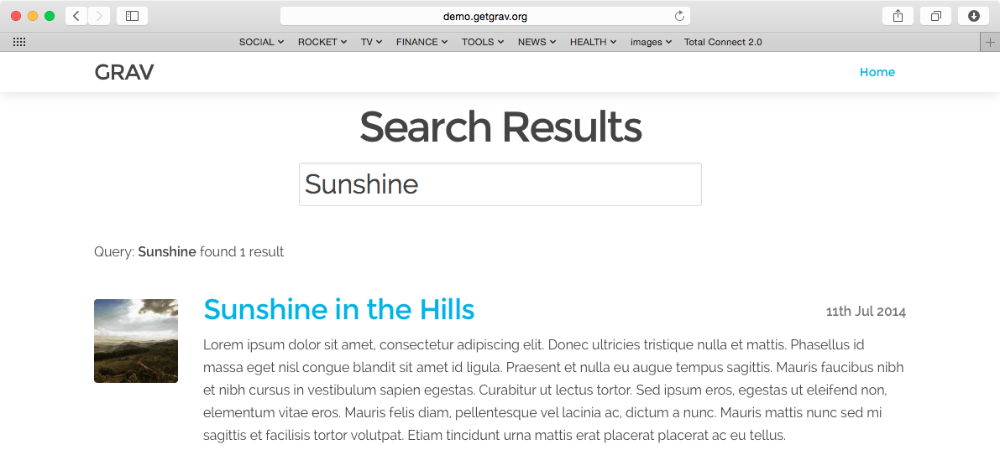

# Grav SimpleSearch Plugin



`SimpleSearch` is a simple, yet very powerful [Grav][grav] plugin that adds search capabilities to your Grav instance. By default it can search Page **Titles**, **Content** and also **Taxonomy**.

# Installation

Installing the SimpleSearch plugin can be done in one of two ways. Our GPM (Grav Package Manager) installation method enables you to quickly and easily install the plugin with a simple terminal command, while the manual method enables you to do so via a zip file.

## GPM Installation (Preferred)

The simplest way to install this plugin is via the [Grav Package Manager (GPM)](http://learn.getgrav.org/advanced/grav-gpm) through your system's Terminal (also called the command line).  From the root of your Grav install type:

    bin/gpm install simplesearch

This will install the SimpleSearch plugin into your `/user/plugins` directory within Grav. Its files can be found under `/your/site/grav/user/plugins/simplesearch`.

## Manual Installation

To install this plugin, just download the zip version of this repository and unzip it under `/your/site/grav/user/plugins`. Then, rename the folder to `simplesearch`. You can find these files either on [GitHub](https://github.com/getgrav/grav-plugin-simplesearch) or via [GetGrav.org](http://getgrav.org/downloads/plugins#extras).

You should now have all the plugin files under

    /your/site/grav/user/plugins/simplesearch

> NOTE: This plugin is a modular component for Grav which requires [Grav](http://github.com/getgrav/grav), the [Error](https://github.com/getgrav/grav-plugin-error) and [Problems](https://github.com/getgrav/grav-plugin-problems) plugins, and a theme to be installed in order to operate.

# Config Options

To effectively use the plugin, you first need to create an override config. To do so, create the folder `user/config/plugins` (if it doesn't exist already) and copy the [simplesearch.yaml][simplesearch] config file in there.

```
search_content: rendered
enabled: true
built_in_css: true
display_button: false
min_query_length: 3
route: /search
template: simplesearch_results
filters:
    category: blog
filter_combinator: and
order:
    by: date
    dir: desc
```

By creating the configuration file: `user/config/plugins/simplesearch.yaml` you have effectively created a site-wide configuration for SimpleSearch.  However, you may want to have multiple searches.

> NOTE: If you want to search **ALL PAGES** just keep the `filters` section empty.

To accomplish multiple search types in a single site, you should use **page-based** configuration. This is simple to do, simply provide any or all of the configuration options under a `simplesearch:` header in your page frontmatter.  For example:

```
simplesearch:
    route: @self
    filters:
        - @self
        - @taxonomy: [tag]
    filter_combinator: and
```

 These page headers will only be taken into account if the search route points to this page.  For example: here the the route points to `@self` which in turn resolves to `/blog`.  You can also specify the route explicity with `route: /blog` if you so choose. This header is within the `/user/pages/blog/blog.md` file.  We will cover this self-controlled form of search handling below.

# Usage

There are two approaches to using SimpleSearch.

## 1. Standalone Search Page

This is the traditional approach and involves having a searchbox 'somewhere' on your site. When you search you are shown a new page that displays the search results.  On this page you will see a summary of the results and be able to click a link to visit each applicable page within your site.  Think about how **Google** and other traditional search engines work.

After installing the SimpleSearch plugin, you can add a simple **searchbox** to your site by including the provided twig template.  Or copy it from the plugin to your theme and customize it as you please:

```

```

By default the **simplesearch_searchbox** Twig template uses the `route` as defined in the configuration.  The SimpleSearch plugin uses this route and then appends a `query:` paramater to create the following final URL.

```
http://yoursite.com/search/query:something
```

1. `/search`: This is the **route** setting and it can be changed
2. `/query:something`: This is the query itself, where `something` is what you are searching for.

The plugin actively looks for URLs requested that match the configured `route` and if so it intercepts the call and renders the results template as specified by the configuration options, (defaults to `simplesearch_results.html.twig` as provided by the plugin).

With this approach, the filters control which pages are searched.  You can have multiple taxonomy filters here, and can configure the combinator to require **any** match (via `or`) or require **all** conditions to match (via `and`).

You can also completely customize the look and feel of the results by overriding the template. There are two methods to do this.

1. Copy the file [templates/simplesearch_results.html.twig][results] under your theme templates `user/themes/_your-theme_/templates/` and customize it.

2. Create your very own results output. For this you need to change the `template` reference in the config (let's say **mysearch_results**). In your theme you would then create the new template under `user/themes/_your-theme_/templates/mysearch_results.html.twig` and write your customizations. This is how it looks by default:

    ```
    

    
        <div class="content-padding">
        <h1 class="search-header">Search Results</h1>
        <h3>Query: "{{ query }}" - Found {{ search_results.count }} {{ 'Item'|pluralize(search_results.count) }}</h3>

        
            
        
        </div>
    
    ```

## 2. Self-Controlled Search Page

This is a new feature of SimpleSearch and it very useful and simple way to provide a 'filter' like search of a collection listing page.  In this example, we will assume you have a Blog listing page you wish to be able to search and filter based on a search box.

To accomplish this, you need ot use the page-based configuration as described above, and configure multiple filters, `@self` to use the page's content collection: http://learn.getgrav.org/content/headers#collection-headers

```
content:
    items: @self.children
    order:
        by: date
        dir: desc
```

This will mean the search will only search pages that this page already is using for the collection.  The Items could be anything the page collections support:

For further help with the `filters` and `order` settings, please refer to our [Taxonomy][taxonomy] and [Headers][headers] documentation.

Multiple filters can be provided, and in order to search in the page's **Tag** field you would add `- @taxonomy: [tag]` as shown in the configuration example above.

The only thing needed to provide this functionality is a search box that points to the current page and appends the `query` parameter.  You can again simple include the sample `simplesearch_searchbox.html.twig` file or add your own. Because the route is configured to point to the blog page, and because the blog page already iterates over a collection, SimpleSearch will replace the page collection with the search-filtered collection.  No results page is required.

## Performance

Simple search is not a full-fledged index-powered search engine.  It merely iterates over the pages and searches the content and title for matching strings.  That's it.  This is not going to result in screaming fast searches if your site has lots of content.  One way to optimize things a little is to change the `search_content` configuration option from `rendered` to `raw`.  This means the `rawMarkdown()` method is used rather than the `content()` method, to retrieve the page content, and in turn means plugin events, markdown processing, image processing, and other time consuming tasks are not performed.  This can often yield adequate search results without the need for all this extra work. 

## Searching Taxonomy

By default **SimpleSearch** will search in the **Title**, **Content**, and **Taxonomy**.  All taxonomy will be searched unless you provide a **taxonomy filter** either in the page, or in the global plugin configuration:

```
filters:
    - @taxonomy: [tag]
```

This will ensure that only **tag** taxonomy types will be searched for the query.

```
filters:
    - @taxonomy: [tag, author]
```

Will ensure that both **tag** and **author** taxonomy types are searched.

As **all taxonomy types are searched by default**, in order to stop searching into taxonomies completely simply set the filter to false:

```
filters:
    - '@taxonomy': false
```

## Ignoring accented characters

You can tell Simplesearch to return a positive value when searching for characters that have an accent. So `éè` for example will be both equivalent to `e`.

To do so, enable _Ignore accented characters_ in Admin, or manually set `ignore_accented_characters` to true in the plugin configuration.
The `en_US` locale must be installed on the server.

# Updating

As development for SimpleSearch continues, new versions may become available that add additional features and functionality, improve compatibility with newer Grav releases, and generally provide a better user experience. Updating SimpleSearch is easy, and can be done through Grav's GPM system, as well as manually.

## GPM Update (Preferred)

The simplest way to update this plugin is via the [Grav Package Manager (GPM)](http://learn.getgrav.org/advanced/grav-gpm). You can do this with this by navigating to the root directory of your Grav install using your system's Terminal (also called command line) and typing the following:

    bin/gpm update simplesearch

This command will check your Grav install to see if your SimpleSearch plugin is due for an update. If a newer release is found, you will be asked whether or not you wish to update. To continue, type `y` and hit enter. The plugin will automatically update and clear Grav's cache.


> Note: Any changes you have made to any of the files listed under this directory will also be removed and replaced by the new set. Any files located elsewhere (for example a YAML settings file placed in `user/config/plugins`) will remain intact.

[taxonomy]: http://learn.getgrav.org/content/taxonomy
[headers]: http://learn.getgrav.org/content/headers
[grav]: http://github.com/getgrav/grav
[simplesearch]: simplesearch.yaml
[results]: templates/simplesearch_results.html.twig
